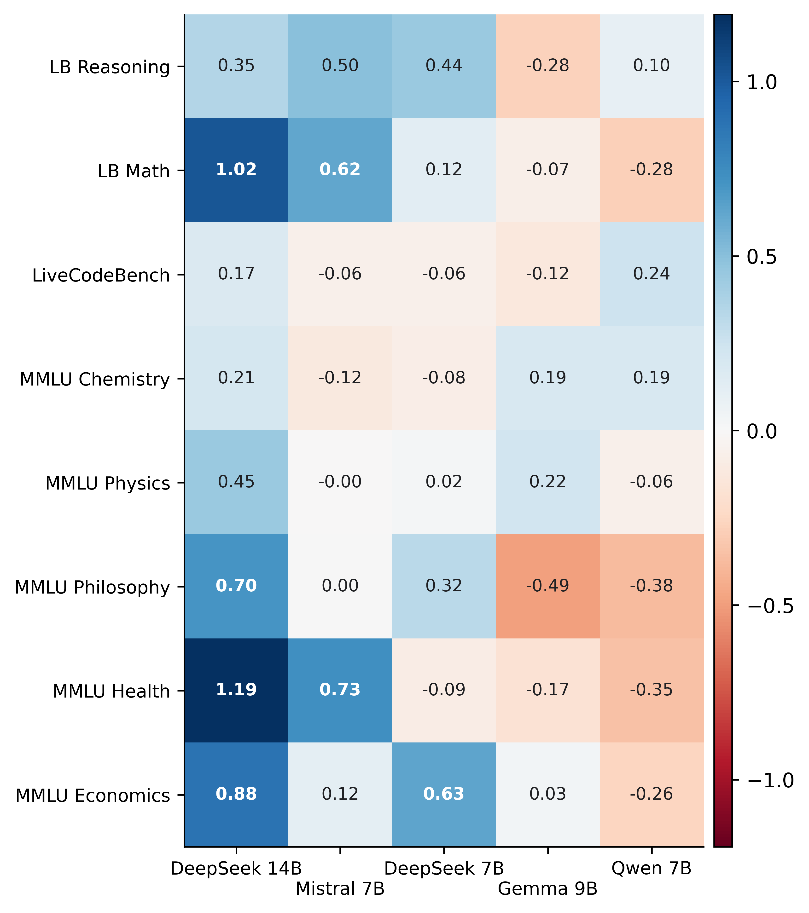

# Rankings Are Not Stable Across Item Populations

Bayesian IRT analysis of LLM judge reliability on JudgeBench. Five local judges are evaluated under one shared binary-verdict interface. The main finding: judge rankings depend on which items you evaluate on.

- On GPT-derived items, DeepSeek 14B is a stable top judge (*P*(top > second) ≥ 0.87)
- On Claude-derived items, top ordering flips and posterior separation drops to *P* ≤ 0.57
- Absolute accuracy peaks at 0.574 — no judge is strong enough for standalone arbitration. More expensive models might have higher accuracy.

<p align="center">
  
  &nbsp;&nbsp;
  
</p>

*Left: posterior densities of global judge reliability θ. DeepSeek 14B separates upward; middle ranks overlap. Right: source-conditioned posterior means show judge strengths vary across item families.*

## Approach

1. Load JudgeBench items (question + two candidate responses + gold label)
2. Each judge picks A or B via constrained decoding — verdict scored against gold label → binary 0/1
3. Fit hierarchical Bayesian 2PL IRT (PyMC NUTS) separating judge reliability from item difficulty
4. Compare posterior rankings across GPT/Claude splits and global/source-hierarchical model variants

## Methods & Stack

**Bayesian modeling:** 2PL IRT with source-conditioned judge effects, PyMC NUTS (4 chains, 1000 draws), PSIS-LOO/WAIC model comparison

**Inference pipeline:** MLX local judge inference on Apple Silicon, constrained binary-verdict decoding, append-only JSONL logs, reproducible config-driven runs

**Experiment tracking:** MLflow with SQLite metadata, posterior artifacts, diagnostics, and figures per tracked run

## Quick Start

```bash
curl -LsSf https://astral.sh/uv/install.sh | sh
uv sync
make setup-models
make tracked-study-all
```

Requires Apple Silicon Mac with ≥ 64 GB unified memory. `google/gemma-2-9b-it` is gated on Hugging Face (`HF_TOKEN` in `.env`).

## Docs

- [Workflow](docs/workflow.md) — setup, model verification, pipeline commands
- [Structure](docs/structure.md) — repo layout and artifact flow
- [Assumptions](docs/assumptions.md) — what the experiment treats as true
- [Limitations](docs/limitations.md) — interpretation boundaries

## License

This repository is public for viewing only. All rights reserved.
No use, copying, modification, distribution, or derivative works permitted without prior written permission.
