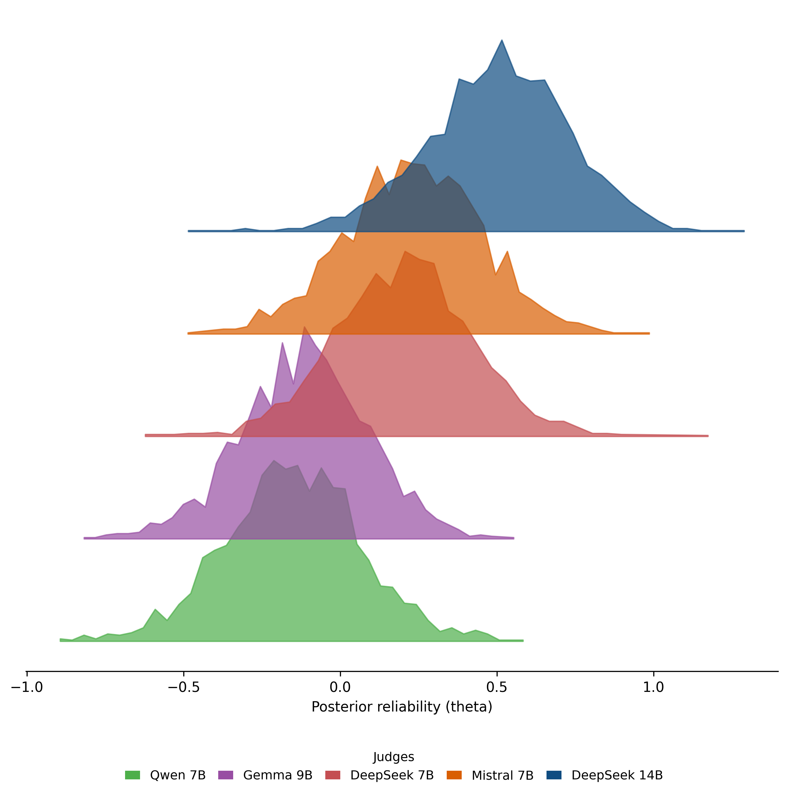

# Bayesian LLM Judge Reliability

Measure how reliable local LLM judges are on JudgeBench with Bayesian Item Response Theory. This repo runs local MLX judges, builds an item-by-judge correctness matrix, and fits Bayesian 1PL/2PL IRT models in PyMC.



## What It Does

- runs local judge models with a fixed constrained `FINAL VERDICT: A|B` protocol
- rebuilds a binary judge-by-item matrix from append-only JSONL logs
- fits Bayesian IRT to separate judge reliability from item difficulty
- produces posterior diagnostics, global judge figures, and source-aware comparison figures

## Current Setup

- dataset: JudgeBench via Hugging Face
- judges: local MLX-compatible models
- protocol: one fixed verdict-only pointwise comparison prompt
- inference: PyMC NUTS with reproducible config-driven settings
- outputs: parquet items/matrix, posterior `.npz`, diagnostics, and figures

## Quick Start

```bash
uv sync
make pre-commit-install
make setup-models
make full
```

## Docs

- [Workflow](docs/workflow.md): setup, model verification, and pipeline commands
- [Profiling](docs/profiling.md): full-run metrics and stage profiling
- [Structure](docs/structure.md): repo layout and artifact flow
- [Assumptions](docs/assumptions.md): what the current experiment treats as true
- [Limitations](docs/limitations.md): what the current results do not justify

## License

This repository is public for viewing only. All rights are reserved.

No use, copying, modification, distribution, or derivative works are permitted
without prior written permission from the author.
