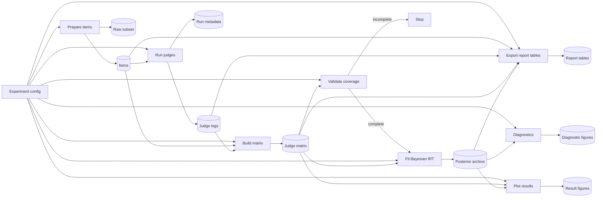
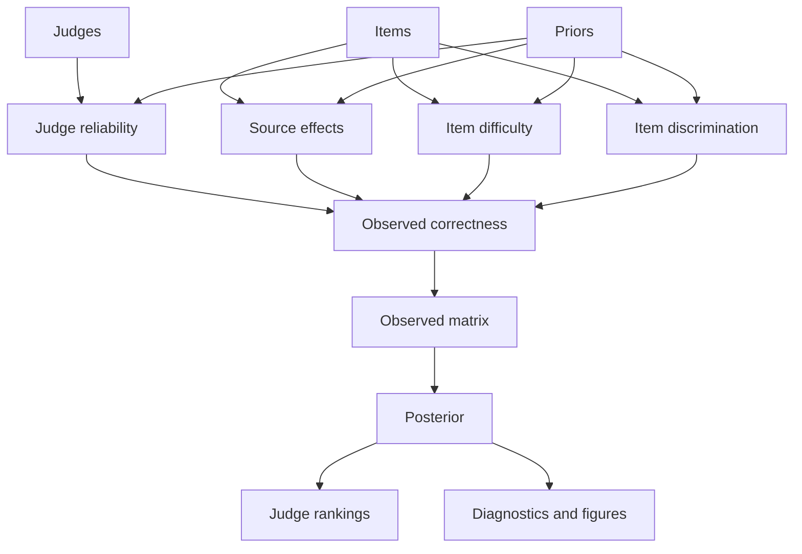

# Structure

```text
configs/experiment.yaml
  -> src/schemas.py
  -> src/data/loader.py
  -> src/judges/runner.py
  -> src/models/irt_common.py
  -> src/models/irt_pymc.py
  -> src/analysis/*.py
```

## Review-first diagrams

These two diagrams are meant to orient a cold reviewer quickly. First read pipeline artifact flow. Then read model diagram for interpretation.

### End to end pipeline and artifact flow



### Conceptual statistical model



- `configs/experiment.yaml`: single source of truth for data, judges, and inference
- `src/data/`: item preparation, matrix construction, validation
  Why: generated artifacts are derived from a reproducible sampled item set rather than ad hoc runs.
- `src/data/matrix_semantics.py`: shared source of truth for metadata columns, original-order log semantics, and judge-level matrix summaries
  Why: validation, plotting, and report exports now consume one matrix contract instead of reimplementing it.
- `src/judges/`: prompts, parsing, MLX backend, runner
  Why: judge behavior is defined by the whole harness, not just the model ID.
- `src/models/`: shared IRT helpers and PyMC inference
  `src/models/infer.py` owns end-to-end inference orchestration, while `src/models/irt_pymc.py` focuses on backend-specific model construction and sampling.
- `src/analysis/`: diagnostics, figures, posterior queries
  `src/analysis/posterior_utils.py` owns reusable posterior-data helpers so plots and exports can share one implementation.

## Critical Building Blocks

- `data/logs/*.jsonl` are the canonical run records.
  What: append-only judge outputs with item metadata and parsed verdicts.
  Why: matrix, validation, and posterior artifacts can be rebuilt from logs without trusting in-memory run state.
  Current contract: logs must have matching `*.config.json` sidecars. Legacy logs without sidecars are unsupported.

- `src/judges/mlx_backend.py` implements constrained verdict-only decoding.
  What: assistant-side prefill plus a logits processor that allows only a verdict token and EOS.
  Why: prompt instructions alone were not enough to keep local judges format-stable.

- `src/judges/token_constraints.py` centralizes tokenizer compatibility checks shared by runtime and verification.
  What: single-token `A` or `B` support plus EOS resolution used by both `mlx_backend.py` and `scripts/verify_models.py`.
  Why: verification must prove exact runtime constraints rather than a parallel approximation.

- `src/judges/runner.py` executes judges sequentially and clears MLX model cache between judges.
  What: one-process orchestration with explicit cache cleanup after each judge.
  Why: local MLX / Metal memory behavior made multi-model lifecycle management part of the architecture.
  Current contract: sidecar fingerprints now include prompt protocol version, so protocol changes invalidate old logs instead of silently reusing them.

- Judge execution is resumable at the log layer.
  What: runner skips already logged `(item_id, prompt_order)` pairs when appending to a judge JSONL.
  Why: interrupted judge runs can continue safely, but downstream artifacts are only meaningful once intended judge coverage is complete.

- Posterior analysis now requires current schema archives.
  What: analysis expects schema version 1 archives with saved judge accuracy PPC summaries.
  Why: old archives are unsupported rather than partially tolerated, which keeps downstream plotting and report contracts explicit.
